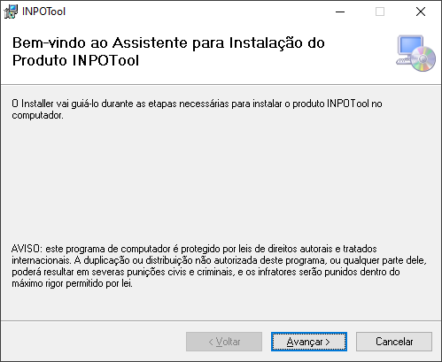
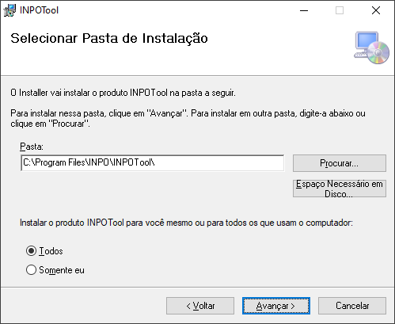
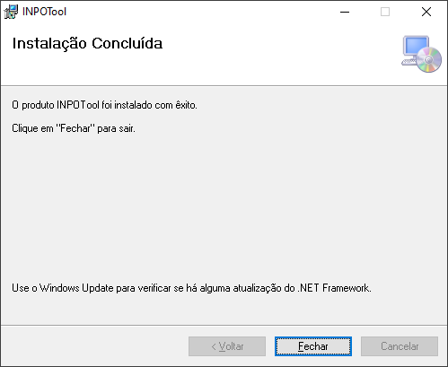

Com o instalador em mãos, o usuário deve executar o aplicativo “SPOT.R v6.3.exe” para iniciar a
instalação do sistema, que abre a tela retratada pela figura abaixo:

<figure markdown="span">
  { width="500" }
  <figcaption>Image caption</figcaption>
</figure>

Ao clicar em “Avançar”, o usuário é direcionado para a próxima tela, onde pode selecionar a pasta
de instalação, além de selecionar os usuários do computador para a instalação do produto (Figura 2).

<figure markdown="span">
  { width="500" }
  <figcaption>Image caption</figcaption>
</figure>

Assim, deve-se clicar em “Avançar” e aguardar até que a instalação seja concluída. Após finalizada
a instalação, o usuário se depara com a tela da Figura 3, onde poderá fechar o instalador para dar fim ao
processo de instalação.

<figure markdown="span">
  { width="500" }
  <figcaption>Image caption</figcaption>
</figure>