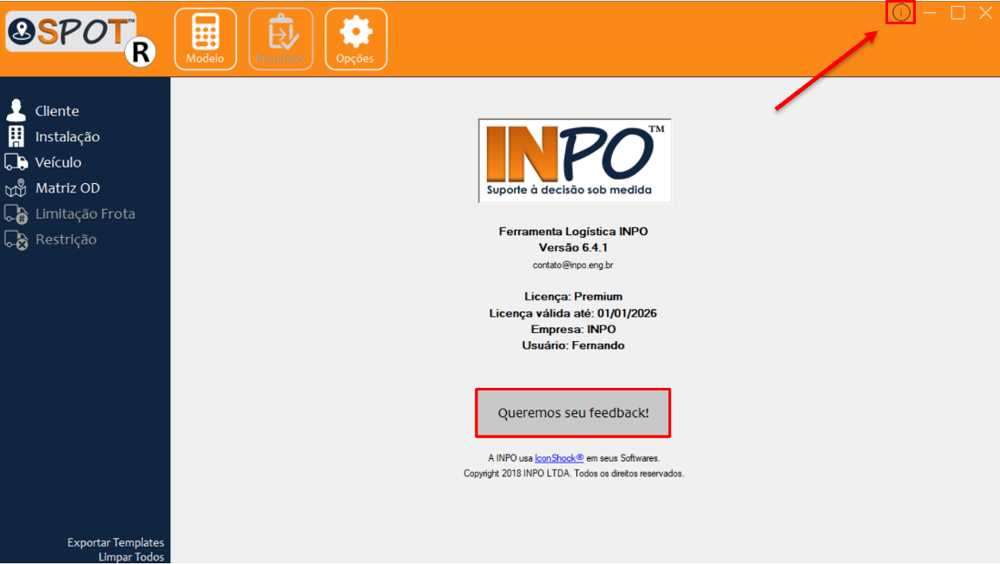

Com o objetivo de aprimorar as ferramentas da INPO nesta seção, além de verificar a versão
utilizada do software e a validade de sua licença, também é possível sugerir melhorias e dar feedbacks sobre
a ferramenta. Para enviar sugestões basta clicar no botão e em seguida preencher o formulário
que será aberto em seu navegador.

<figure markdown="span">
  { width="500" }
  <figcaption>Image caption</figcaption>
</figure>