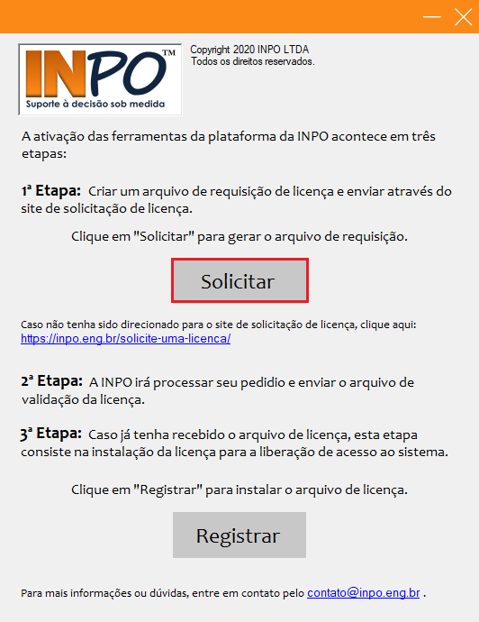
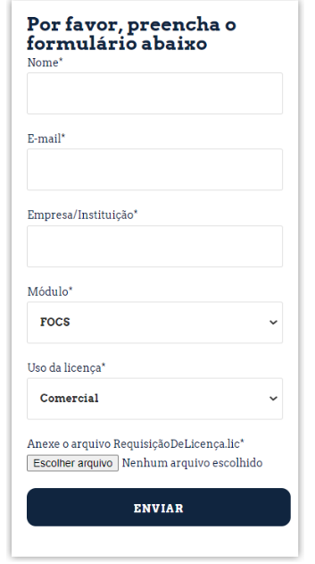
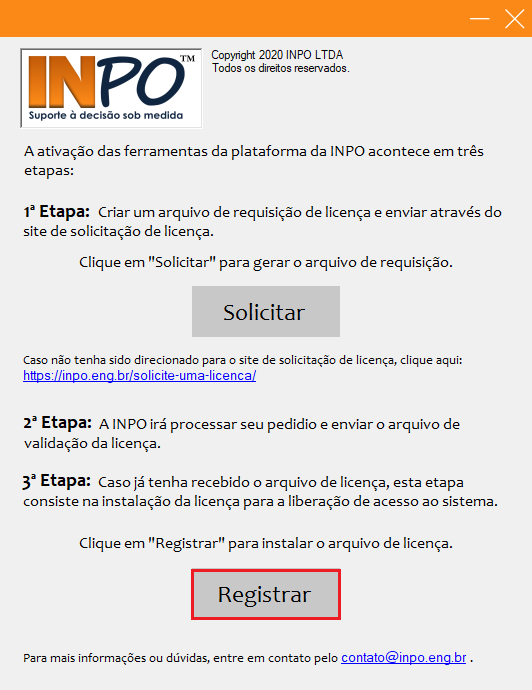
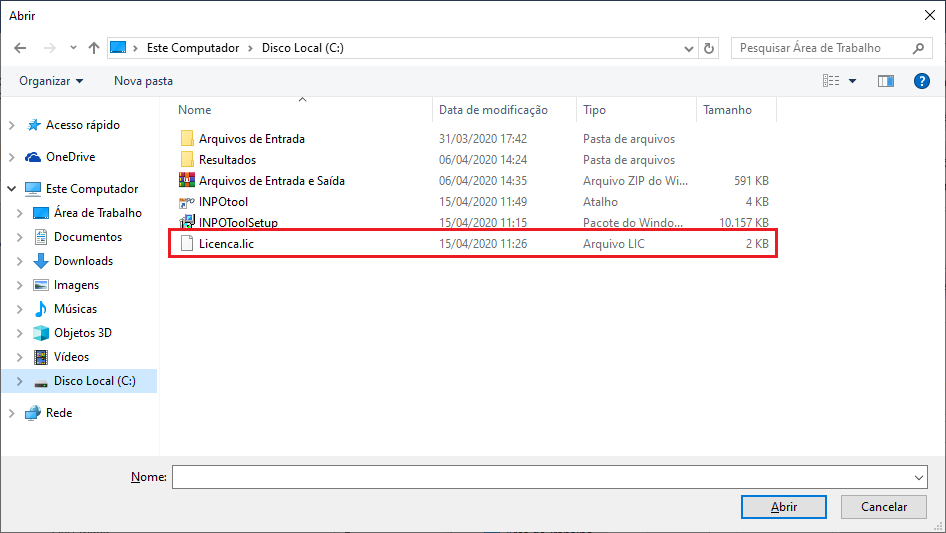
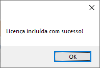

Após a instalação, pode-se executar o aplicativo “SPOT.R.exe” criado automaticamente na área de
trabalho.

Caso seja a primeira vez que o aplicativo esteja sendo aberto, será necessário realizar o processo de
ativação de licença. Para isso, basta clicar em “Solicitar” e salvar o arquivo de requisição no
local desejado. Depois de salvar o arquivo, a página de solicitação de licença do site INPO
(https://inpo.eng.br/solicite-uma-licenca/) será aberta. Os campos do formulário devem ser
preenchidos, e no final dele, anexado o arquivo de requisição.

<figure markdown="span">
  { width="500" }
  <figcaption>Image caption</figcaption>
</figure>

<figure markdown="span">
  { width="450" }
  <figcaption>Image caption</figcaption>
</figure>

Após o envio do formulário, a INPO processará a informação e entrará em contato para fornecer
a licença. Assim que receber o arquivo, o usuário deverá concluir o registro por meio do botão “Registrar”, selecionando o arquivo de licença recebido .

<figure markdown="span">
  { width="450" }
  <figcaption>Image caption</figcaption>
</figure>

<figure markdown="span">
  { width="450" }
  <figcaption>Image caption</figcaption>
</figure>

Feito isso, a mensagem de conclusão do registro da licença é exibida (Figura 8). A partir de então,
o usuário pode utilizar a ferramenta e recursos do sistema normalmente.

<figure markdown="span">
  { width="200" }
  <figcaption>Image caption</figcaption>
</figure>

Com a instalação do SPOT.R, dois conjuntos de arquivos de dados serão salvos no diretório
padrão do sistema (%users/documentos/INPO/SPOT.R), e devem ser utilizados como exemplo e
padrão para importação de arquivos. O processo de importação de arquivos é detalhado na sequência.